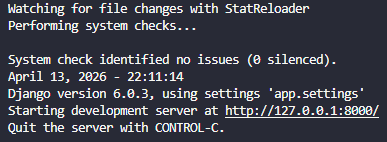
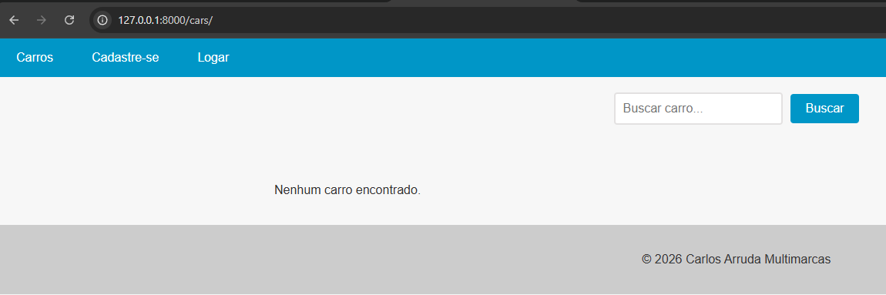
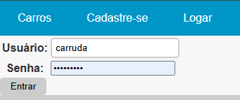
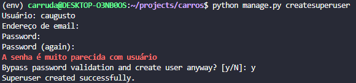
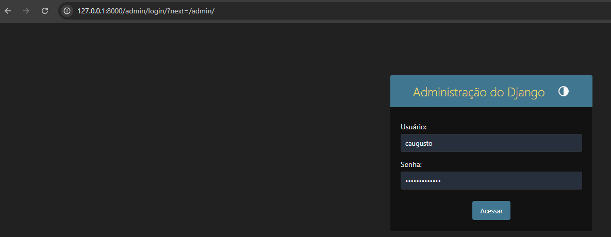
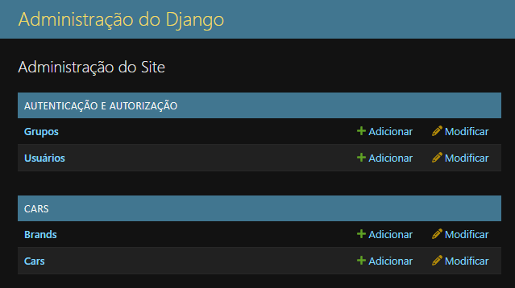
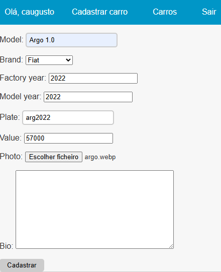
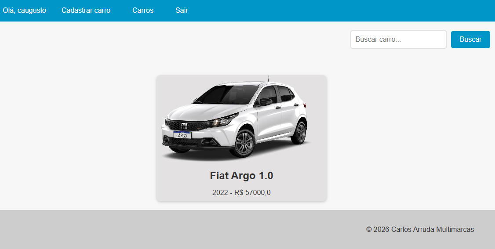
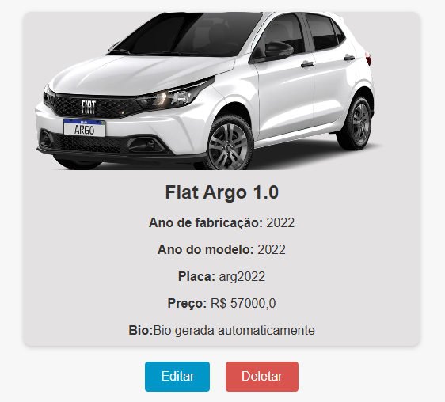

# **`Documentação do projeto Carros`**

# Funcionalidades do projeto
- `Funcionalidade 1`: Gerenciamento de Carros | CRUD completo
- `Funcionalidade 2`: Gerenciamento de Acessos, criação e acesso com login

<!-- # 📁 Acesso ao projeto
**Indique como é possível baixar ou acessar o código fonte do projeto, seja projeto inicial ou final** -->

# 🛠️ Abrir e rodar o projeto
**Instruções necessárias executar o projeto**

#### Partindo do pressuposto que já tenha o Python instalado e um terminal para executar os comandos
1. Clone the repo  
```bash 
git clone https://github.com/caugustoarruda/carros 
```
2. Ative ou Crie seu ambiente virtual
```bash 
python -m venv env ou source/bin/activate para ativar um ambiente virtual ja existente
```
3. Instale as dependencias  
```bash 
pip install -r requirements.txt
```
4. Tenha um gerenciador de banco de dados instalado ou utilize o sqlite, banco padrão adotado pelo Django

5. O próximo passo será definir qual sera o banco de dados utilizado, alterando uma simples configuração no `settings` do projeto 

   - vá na pasta app do projeto e procure por `settings.py`
   - procure onde está a definição de banco de dados `DATABASES`
   - e ai agora é so configurar com seu banco preferido seguindo os exemplos abaixo:

   sqlite
   ```py
    DATABASES = {
        'default': {
            'ENGINE': 'django.db.backends.sqlite3',
            'NAME': BASE_DIR / 'db.sqlite3',
        }
    }
   ```
   postgres
   ```py
    DATABASES = {
      'default': {
          'ENGINE': 'django.db.backends.postgresql',
          'NAME': 'NOME DO SEU BANCO',
          'USER': 'USUARIO DO BANCO',
          'PASSWORD': 'SENHA',
          'HOST': 'localhost',
          'PORT': '5432'
      }
    }
   ```
6. Seguindo, será necessário executar o comando migrate do Django, para que seja criado as tabelas necessárias para que a aplicação rode
```py
   python manage.py migrate
```
7. Se chegou até aqui, agora é so executar o comando para disponibilizar o projeto localmente
```py
   python manage.py runserver
```
se tudo ocorreu bem, você verá uma mensagem no terminal igual a mensagem abaixo



Pronto! Agora você já pode acessar a aplicação digitando o endereço informado no termial após executar o comando runserver
`127.0.0.1:8000/cars`



Agora você já pode se logar ou se cadastrar pela interface do navegador, basta preencher os dados e pronto!



Quando você se logar, terá como opção cadastrar novos veículos, mas para isso ser possível você terá que cadastrar a marca do veículo e isso só é possível com superuser
1. Para criar um super user, basta executar o comando abaixo e seguir os passos solicitados:
```py
   python manage.py createsuperuser
```


Com a criação do superuser com sucesso, você já consegue acessar a area admin do sistema digitando a url `127.0.0.1:8000/admin`



Ao se logar, você estará com acesso adminstrador e podera cadastra novas marcas(Brands) ou novos carros(Cars) bem como usuarios, grupo, deletar, editar, etc... conforme imagem abaixo:



2. Clique em Brands e crie uma nova Marca

3. Dessa forma, você já pode acessar a tela de login com um usuario com perfil não admin ou se preferir admin e cadastrar seu primeiro carro



4. Cadastrando um novo carro, ele ira aparecer na listagem conforme abaixo:



5. Agora você pode clicar no carro criado, e Editar, Deletar ou apenas ver os detalhes do mesmo



E com isso encerramos o fluxo, agora explore a Edição, Deleção, e note que na Bio foi preenchida uma informação aleatória gerada automaticamente, isso se deve, pelo fato que esta sendo utilizado um Signal pre-save, que complementa a informação caso o campo não seja preenchido. Mas esse signal pode usar integração com o GPT.
Bastando por tanto para isso, procurar na pasta open_api pelo arquivo `client.py`, nesse arquivo você pode inserir sua credencial/token e se quiser alterar também o prompt que esta sendo utilizado.

```py
   def get_car_ai_bio(model, brand, year):
    openai.api_key = 'SEUTOKENAQUI'

    prompt = f"""
    Me mostre um descrição de venda para o carro {model} {brand} {year} em apenas 250 caracteres. Fale coisas essenciais para venda.
    """
    respose = openai.completions.create(
        model='davinci-002',
        prompt=prompt,
        max_tokens=1000,
    )
    return respose
```